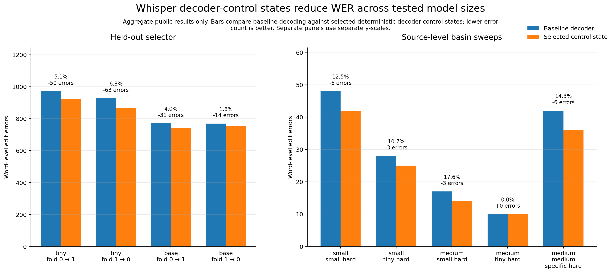
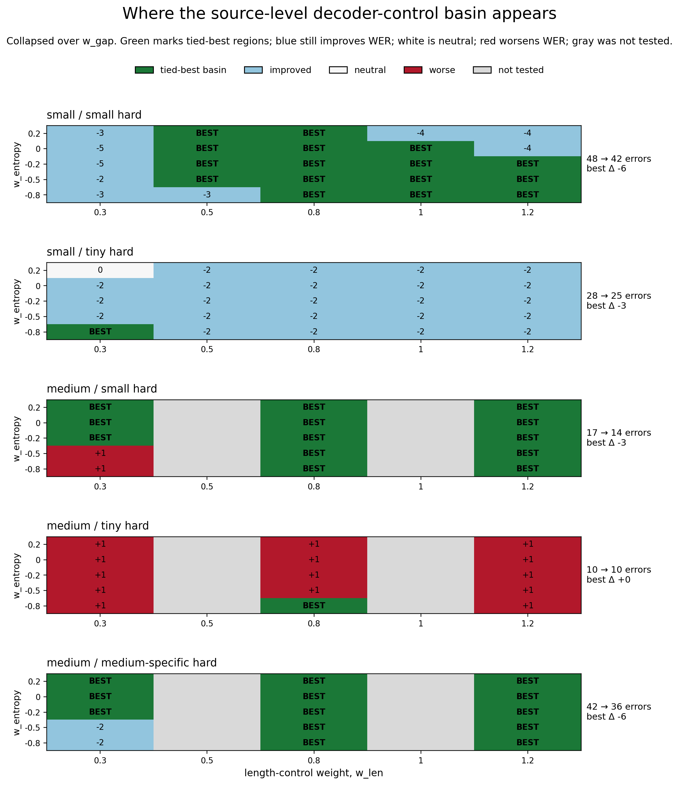

# Whisper Decoder Control Basin

This repository reports a source-level decoder-control experiment in `whisper.cpp`.

Rather than tuning an external wrapper, the experiment modifies Whisper's C++ decoder source directly. The intervention is localized to `whisper_sequence_score` in `src/whisper.cpp`, where token-level log probabilities are reduced into a final sequence score. The added control surface is zero-default, so baseline behavior is preserved when disabled.

The main public result is not a single lucky parameter setting. The important finding is that improvement appears in a basin: multiple nearby decoder-control states produce similar or improved word error rate (WER), and the same qualitative region transfers across tested model sizes.

In plain terms: this experiment found a controllable low-dimensional decoder surface inside Whisper's scoring logic.

## What was modified

The intervention was added inside `whisper_sequence_score` in `src/whisper.cpp`, after the sequence entropy calculation and before the final sequence score is used for candidate ranking.

The public control surface used three deterministic axes: score-gap, entropy, and sequence length. All added weights default to zero, so the patch preserves baseline Whisper behavior unless explicitly enabled.

This makes the experiment a source-level decoder-control test, not prompt engineering, wrapper tuning, retraining, or post-processing.

## Summary

Experiments were run with a local sandbox derived from `whisper.cpp`.

Public results included here:

- Held-out selector results on `ggml-tiny.en.bin`
- Held-out selector results on `ggml-base.en.bin`
- Parameter-basin sweeps on `ggml-small.en.bin`
- Parameter-basin transfer sweeps on `ggml-medium.en.bin`

The repository intentionally includes only aggregate public outputs. It does not include model weights, audio data, private research machinery, or proprietary pipeline details.

## Key results

| Result group | Model | Dataset | Baseline errors | Selected errors | Delta errors | Relative reduction |
|---|---:|---|---:|---:|---:|---:|
| heldout selector | ggml-tiny.en.bin | fold 0 → 1 | 972 | 922 | -50 | 5.14% |
| heldout selector | ggml-tiny.en.bin | fold 1 → 0 | 928 | 865 | -63 | 6.79% |
| heldout selector | ggml-base.en.bin | fold 0 → 1 | 771 | 740 | -31 | 4.02% |
| heldout selector | ggml-base.en.bin | fold 1 → 0 | 769 | 755 | -14 | 1.82% |
| parameter basin | small | small-specific hard manifest | 48 | 42 | -6 | 12.50% |
| parameter basin | small | tiny-original hard manifest | 28 | 25 | -3 | 10.71% |
| parameter basin | medium | small-specific hard manifest | 17 | 14 | -3 | 17.65% |
| parameter basin | medium | tiny-original hard manifest | 10 | 10 | 0 | 0.00% |
| parameter basin | medium | medium-specific hard manifest | 42 | 36 | -6 | 14.29% |

The medium run on the tiny-original hard manifest did not improve WER, but it also did not regress at the selected basin point. Medium improved on two more informative hard subsets: errors dropped from 17 to 14 on the small-specific transfer manifest and from 42 to 36 on the medium-specific hard manifest.

## Basin map

The source-level control surface is not a single isolated setting. Collapsing over the mostly inactive `w_gap` axis exposes a lower-dimensional `w_entropy × w_len` basin.

Green regions below are tied-best basin cells, blue regions still improve WER, white regions are neutral, red regions worsen WER, and gray regions were not tested.

## Interpretation

The results suggest that Whisper decoding has controllable local structure. Small deterministic changes to decoder scoring can move outputs into lower-WER regions without retraining the model.

The important public claim is limited:

> On these tested manifests and model sizes, deterministic decoder-control sweeps found stable regions that reduced WER relative to baseline decoding.

This is not a claim that the method is universally optimal, not a replacement for full ASR benchmarking, and not a claim that every dataset or model size improves.

## Files

| File | Description |
|---|---|
| `data/public_result_summary.csv` | Compact public summary table used for the README results. |
| `data/heldout_selector_summary.csv` | Held-out selector summary for tiny/base experiments. |
| `data/small_dual_manifest_summary.csv` | Small-model parameter-basin sweep summary. |
| `data/medium_dual_manifest_summary.csv` | Medium-model transfer sweep summary. |
| `data/medium_specific_hard_summary.csv` | Medium-model medium-specific hard-manifest sweep summary. |
| `notes/upstream_source.md` | Upstream `whisper.cpp` source reference and local commit metadata. |

## Upstream source

This work used a local sandbox derived from the open-source [`whisper.cpp`](https://github.com/ggerganov/whisper.cpp) project.

Recorded local upstream source:

- Repository: `https://github.com/ggerganov/whisper.cpp`
- Commit: `5980b1ae77ab5390fe189df6e8798fd06f939223`
- Short commit: `5980b1a`
- Commit date: `2024-12-08 23:09:26 +0200`
- Commit subject: `devops : add cmake`

See `notes/upstream_source.md`.

## Reproducibility boundary

This repository is a public result report, not a full reproduction package.

It does not include:

- Whisper model weights
- LibriSpeech audio files
- Full transcript outputs
- Private experimental machinery
- Internal research-selection logic

It does include the aggregate result tables needed to inspect the public claims.

## License and attribution

This repository reports experimental results from a local sandbox derived from `whisper.cpp`. See the upstream project for its original license and source code.
